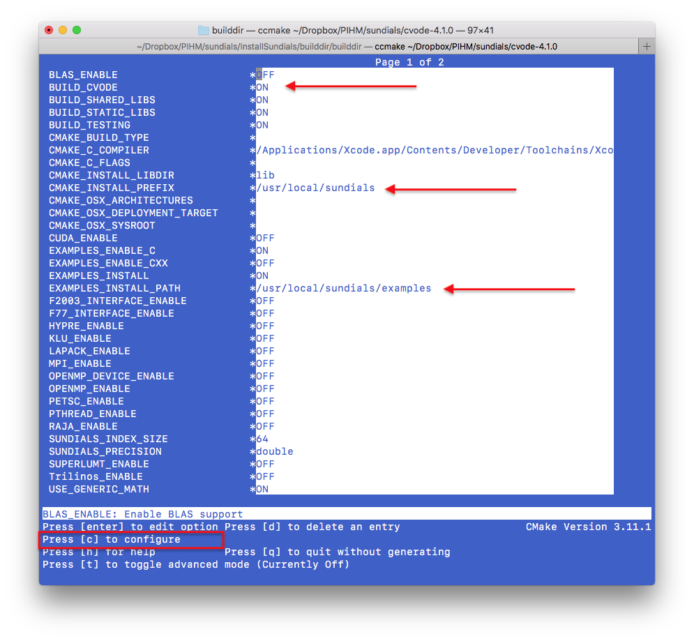

# Install PIHM and PIHMgisR

## SUNDIALS/CVODE
The PIHM model requires the support of SUNDIALS or CVODE library. 
[**SUNDIALS**](https://computation.llnl.gov/projects/sundials) is a SUite of Nonlinear and DIfferential/ALgebraic equation Solvers, consists of six solvers.  [**CVODE**](https://computation.llnl.gov/projects/sundials/cvode) is a solver for stiff and nonstiff ordinary differential equation (ODE) systems (initial value problem) given in explicit form $y' = f(t,y)$. The methods used in CVODE are variable-order, variable-step multistep methods. You can install the entire SUNDIALS suite or CVODE only. 

Since the SUNDIALS/CVODE keeps updating periodically and significantly, the function names and structure are changed accordingly, we suggest to use the specific version of the solver, rather than the latest solver.


| PIHM Version | SUNDIALS/CVODE version | 
|:---------:|:---------:|
| PIHM v1.x | v2.2 ~ v2.4 |
| PIHM v2.x | v2.2 ~ v2.4 |
| PIHM v3.x | v2.2 ~ v2.4 |
| MM-PIHM v1.x | v2.4 |
| PIHM++ v4.x | v3.x |

SUNDIALS/CVODE is available in [LLNL: https://computation.llnl.gov/projects/sundials/sundials-software](https://computation.llnl.gov/projects/sundials/sundials-software)

The installation of CVODE v3.x:


1. Go to your Command Line and enter your workspace and unzip your CVODE source code here.
1. make directories for CVODE, including *builddir*, *instdir* and *srcdir*
```
mkdir builddir
mkdir instdir
mkdir srcdir
cd builddir/
```
1. Try ccmake. Install ``cmake`` if you don't have one.
```
ccmake 
```

1.  Run ccmake to configure your compile environment.
```
ccmake /Users/leleshu/Dropbox/PIHM/sundials/cvode-4.1.0
```

This is a empty configure. Press `c` to start the configuration.


The default configuration. Make sure the value for three lines:
```
BUILD_CVODE = ON
CMAKE_INSTALL_PREFIX = /usr/local/sundials
EXAMPLES_INSTALL_PATH = /usr/local/sundials/examples
```
After the modification of values, press `c` to confirm configuration.


The ccmake configures the environment automatically. When the configuration is ready, press `g` to genrate and exit.

1. Then you run commands below:
```
make
make install 
```

1. Optional library copy
Sometimes, the code might not find the right library support in your system, try to copy the library in sundials folder to your system library folder.

```
cp /usr/local/sundials/lib/* /usr/local/lib/
```

## PIHM

Configuration in *Makefile*:

1. Path of *SUNDIALS_DIR.* [**CRITICAL**]
1. Path of OpenMP if the parallel is preferred.
1. Path of SRC_DIR, default is `SRC_DIR = .`
1. Path of BUILT_DIR, default is `BUILT_DIR = .` 

After updating the SUNDIALS path in the *Makefile*, user can compile the PIHM with:
```
make clean
make pihm
```

There are more options to compile the PIHM code:

- `make all`            - make both pihm and pihm_omp
- `make pihm`         - make pihm executable
- `make pihm_omp`    - make pihm_omp with OpenMP support
- `make calib_mpi`   - make calib_mpi with MPI support
- `make calib_omp`   - make calib_omp with OpenMP support


### OpenMP
If parallel-computing is prefered, please install OpenMP.     For mac: 
```
brew install llvm clang
brew install libomp
compile flags for OpenMP: 
  -Xpreprocessor -fopenmp -lomp
Library/Include paths:
  -L/usr/local/opt/libomp/lib 
  -I/usr/local/opt/libomp/include
```
### Run pihm executables.
After the successful installation and compile, you can run PIHM models using
```
./pihm <projectname>
```


Command line pattern is:
```
./pihm [-p projectfile] [-o output_folder] [-n Num_Threads] <project name> 
```
- `<project name>` is the name of the project
- `[-p projectfile]`
- `[-o output_folder]` is to write all model output variables in the specified output directory
- `[-n Num_Threads]` is number of OpenMP threads, which works with `pihm_omp` only.


When the `pihm++` program starts to run, the screen should look like this:


## PIHMgisR
This PIHMgisR is an R package. What you need is to install the package as a source code package.
For example:
```
install_github('shulele/PIHMgisR')
```

That is all you need to deploy the PIHMgisR.